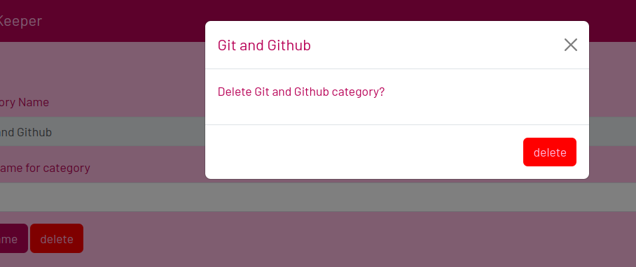

# Flask resource keeper app

## [Live site here](https://resource-keeper-9faa6ecfb87f.herokuapp.com/)
# Overview
* Resource Keeper is a flask app that allows users to store and retrieve references and resources (as urls) in a SQL relational database.
* The rationale and design strategy for the app comes from my own experience of finding a solution to keep online resources in a an organized way.
* The app is intended for use by students or anyone that wants a simple way to keep url resources in a database.
* Users are able to view saved resources by category and see a short description of the resource.
* The database stores the url for each resource and users can go straight from the list to the visit the resource.
* Users are able to create categories and add resources to the categories for future reference.
* Users are able to edit and delete both categories and resources
* The app demonstrates basic database CRUD operations in that users can create records, view records, update and delete records.
* The app provides a simple attractive interface based on the Bootstrap 5 framework.

## User Stories
* User stories are based on the intended scope of the app as described above. The user stories below, were also used to test the app functionality.

|User action |
|--------|
| As a site user, I would like to create a new resource category
| As a site user, I would like to create a new resource within a category
| As a site user, I would like to view existing categories
| As a retuning site user, I would like to view stored resources by category with a short note describing the resource.
| As a site user, I would like to be able to access a resource (ie go to that url).
| As a site user, I would like to be able to edit a resource.
| As a site user, I would like to be able to edit a category name
| As a site user, I would like to be able to move a resource to a different category
| As a site user, I would like to be able to delete a resource
| As a site user, I would like to be able to delete a category
||
## Features
- The features included were intended to serve the user stories detailed above.
### Home Page View
- General view shown below shows main navigation (which is included on all pages)and the button to go to the "add category" view. Also shown are cards showing existing resource categories in the database. 
- 
- The "New Category" button takes the user to a view to add a new category.
- 
- Existing category cards have buttons to go to views to view resources in the category, to add a new resource to the category, and to edit the category.
- 
### Add New Category View
- This view is accessed via the "New Category" button shown above. The view provides an input form for the user to create a new category and add this to the database
- 
### View Stored Resources View
- This view is accessed via the "view" button in the category cards shown above. The view provides a list of the resources for a given category. A link is provided to go to the resource url. A "details" dropdown on-hover, shows a short description of the resource from the database. An "edit" button takes the user to the view to edit the resource.
- 
### Edit Category View
- This view is accessed via the "edit" button on the category card. The view provides an input form for the user to edit the name or delete an existing category. The current category name is shown for reference.
- 
### Delete Category View
- If the user choses to delete a category in the view for editing the category, a pop-up modal is fired to confirm the deletion
- 
### Add New Resource View
- This view is accessed via the "add" button on the category card. The view provides an input form for the user to add the details of a new resource and a button to add the resource to the  database.
- 
### Edit Existing Resource View
- This view is accessed via the "edit" button in the "View stored Resources View" shown above. The view provides an input form for the user to edit the details of an existing resource and a button to add the new resource details to the  database. The delete button provides the option to delete the resource from the database.
- 
### Delete Resource View
- If the user chooses to delete a resource in the view for editing the resource, a pop-up modal is fired to confirm the deletion.
- 

### 404 Error Page
- If the user makes a request to a non-existent route a 404 error page is displayed. A back link is provided to return to the homepage.
- 

## UX
#### Colour palette 
An attractive coherent color palette for the site was generated using [Colorhunt](https://colorhunt.co/palette/b80257dd356efc7fb6ffbbe1) and is shown below.

#### Typography
 [Barlow](https://fonts.google.com/specimen/Barlow?query=barlow) font was used for all site text.
## Tools & Technologies Used
- [Python](https://www.python.org/) used to code flask server and interact with database.
- [Flask](https://flask.palletsprojects.com/en/3.0.x/) used as the backend python framework.
- [Flask-Sqlalchemy](https://flask-sqlalchemy.palletsprojects.com/en/3.1.x/) used to provide object-oriented interaction with SQL database.
- [PostgreSql](https://www.postgresql.org/) used for database management.
- [Heroku](https://www.heroku.com/) flask application hosting.
- [ElephantSQL](https://www.elephantsql.com/) database hosting.
- [HTML](https://en.wikipedia.org/wiki/HTML) used for the main site content.
- [CSS](https://en.wikipedia.org/wiki/CSS) used for the main site design and layout.
- [CSS Flexbox](https://www.w3schools.com/css/css3_flexbox.asp) used for responsive layout.
- [JavaScript](https://www.javascript.com) included for correct functioning of Bootstrap components.
- [Git](https://git-scm.com) used for version control, continuous deployment to Heroku and hosting video assets. (`git add`, `git commit`, `git push`)
- [GitHub](https://github.com) used for secure online code storage.
- [Bootstrap](https://getbootstrap.com) used as the front-end CSS framework for modern responsiveness and pre-built components.
- [VSCode](https://code.visualstudio.com/) IDE for development work.
- [Jinja](https://jinja.palletsprojects.com/en/3.1.x/) used in html templates.
## Testing

For all testing, please refer to the [TESTING.md](TESTING.md) file.

## Cloud Deployment
The app was deployed to the Heroku [Heroku](https://www.heroku.com/) cloud platform, and the database was deployed to the [ElephantSQL](https://www.elephantsql.com/) PostgreSQL as a service provider

### Local Deployment

This project can be cloned or forked in order to make a local copy on your own system.

#### Cloning

You can clone the repository by following these steps:

1. Go to the [GitHub repository](https://github.com/doctorandrewbrown/flask-resource-keeper) 
2. Locate the Code button above the list of files and click it 
3. Select if you prefer to clone using HTTPS, SSH, or GitHub CLI and click the copy button to copy the URL to your clipboard
4. Open Git Bash or Terminal
5. Change the current working directory to the one where you want the cloned directory
6. In your IDE Terminal, type the following command to clone my repository:
	- `git clone https://github.com/doctorandrewbrown/flask-resource-keeper.git`
7. Press Enter to create your local clone.

Alternatively, if using Gitpod, you can click below to create your own workspace using this repository.

Please note that in order to directly open the project in Gitpod, you need to have the browser extension installed.
A tutorial on how to do that can be found [here](https://www.gitpod.io/docs/configure/user-settings/browser-extension).

#### Forking

By forking the GitHub Repository, we make a copy of the original repository on our GitHub account to view and/or make changes without affecting the original owner's repository.
You can fork this repository by using the following steps:

1. Log in to GitHub and locate the [GitHub Repository](https://github.com/doctorandrewbrown/flask-resource-keeper.git)
2. At the top of the Repository (not top of page) just above the "Settings" Button on the menu, locate the "Fork" Button.
3. Once clicked, you should now have a copy of the original repository in your own GitHub account!

## Credits
### Media 
| Source | Location | Notes |
| --- | --- | --- |
| [Favicon.io](https://favicon.io/favicon-generator/) | index.html | used to generate website favicon  |

### Content

| Source | Location | Notes |
| --- | --- | --- |
| [W3Schools](https://www.w3schools.com/) | whole site | reference for bootstrap, html, css and javascript |
| [Markdown Guide](https://www.markdownguide.org/cheat-sheet/) | README and TESTING | syntax guide for writing Markdown files |
| [Html Dropdown](https://www.w3schools.com/css/tryit.asp?filename=trycss_dropdown_text) | edit resource view | Html form dropdown to chose category |
| [Html max-length attribute](https://www.w3schools.com/tags/att_input_maxlength.asp) | input forms | attribute to limit form input length |
| [Html form default value](https://linuxhint.com/add-default-value-for-html-textarea/)| input form view | add placeholder to form fields |
| [Flask error messages](https://www.digitalocean.com/community/tutorials/how-to-handle-errors-in-a-flask-application) | routes.py | Use of flask error messages|
| [Bootstrap Modal](https://www.w3schools.com/bootstrap5/bootstrap_modal.php) | edit category and resources views| Prompt confirmation of deletion from database |
| [Prevent unwanted flexing of bootstrap components](https://www.devsamples.com/css/flexbox-prevent-element-stretching) |resources view| Prevent unwanted flexing of buttons |
| [Github video uoloads](https://github.blog/2021-05-13-video-uploads-available-github/) |documentation| How to include MP4 video |
## Wireframes
## Security
The following basic security measures were taken to protect the deployed app.
- 
## Database Schema
## Bugs

### Acknowledgements

- I would like to thank my Code Institute mentor, Antonio Rodriguez, and Iris Smok of Code Institute, for their help and advice while developing this project. 
