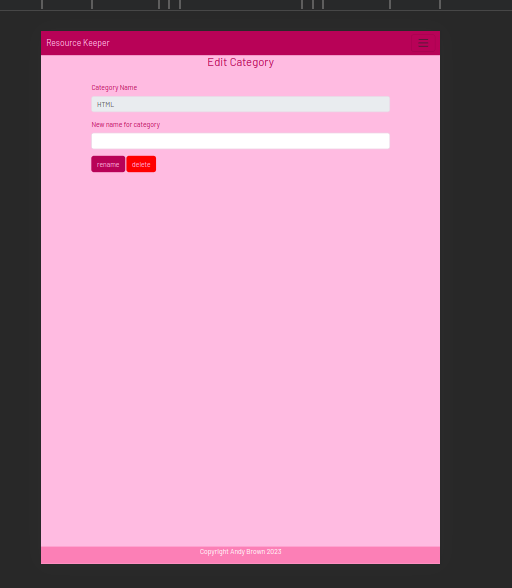

# Testing

Return back to the [README.md](README.md) file.

### HTML

I have used the recommended [HTML W3C Validator](https://validator.w3.org) to validate all of my HTML files.

| Page | W3C URL | Screenshot | |
| --- | --- | --- | --- |
| Home | [W3C](https://validator.w3.org/nu/?doc=https%3A%2F%2Fresource-keeper-9faa6ecfb87f.herokuapp.com%2F) |  | 

### CSS

I have used the recommended [CSS Jigsaw Validator](https://jigsaw.w3.org/css-validator) to validate all of my CSS files.

| File | Jigsaw URL | Screenshot | Notes|
| --- | --- | --- | --- |
| style.css | [Jigsaw](https://jigsaw.w3.org/css-validator/validator?uri=https%3A%2F%2Fresource-keeper-9faa6ecfb87f.herokuapp.com%2F&profile=css3svg&usermedium=all&warning=1&vextwarning=&lang=en) || Some warnings about Bootstrap classes when testing live site. Screenshot shows css code tested by direct input to validator
## Browser Compatibility

I've tested my deployed project on multiple browsers to check for compatibility issues.

| Browser | Screenshot | Notes |
| --- | --- | --- |
| Chrome |  | Works as expected |
| Firefox |  | Works as expected |
| Opera |  | Works as expected |

## Responsiveness

I've tested my deployed project on multiple devices to check for responsiveness issues.

| Device | Page |Screenshot | Notes |
| --- | --- | --- | --- |
| Mobile (DevTools) | Home | | Works as expected |
| Tablet (DevTools) | Home | | Works as expected |
| Laptop | Home | | Works as expected. |
| Mobile (DevTools) | View Resources | | Works as expected |
| Tablet (Dev Tools) | View Resources | | Works as expected. |
| Laptop | View Resources | | Works as expected. |
| Mobile (DevTools) | Add Resource | | Works as expected |
| Tablet (DevTools) | Add Resource | | Works as expected |
| Laptop | Add Resource | | Works as expected. |
| Tablet (DevTools) | Edit Category | | Works as expected |
| Mobile (DevTools) | Edit Category | | Works as expected |
| Laptop | Edit Category | | Works as expected. |
| Mobile (DevTools) | New Category | | Works as expected |
| Tablet (DevTools) | New Category | | Works as expected |
| Laptop | New Category | | Works as expected. |
| Mobile (DevTools) | Edit Resource | | Works as expected |
| Tablet (DevTools) | Edit Resource | | Works as expected |
| Laptop | Edit Resource | | Works as expected. |

## Lighthouse Audit

I've tested my deployed project using the Lighthouse Audit tool to check for any major issues.

| Page | Size | Screenshot | Notes 
| --- | --- | --- | --- |
| Home | Mobile |  | Some minor warnings |
| Home | Desktop |  | Some minor warnings |

## Defensive Programming

Defensive programming was manually tested with the below user acceptance testing:

| User Action | Expected Result | Pass/Fail | Screenshot |Comments|
| --- | --- | --- | --- |---| 
| Click form buttons without filling required form fields | Inform user field is required | Pass | |The screenshot shows the "tip" informing user field is required. This protection applies to all required form fields inthe app|
| Delete a resource or category from database | A modal appears prompting for delete confirmation | Pass | |Modal requiring confirmation is triggered on deleting a category or resource from database|

## User Story Testing

| User Story | Demo Video | Comments |
| --- | --- |----| 
| As a site user, I would like to create a new resource category | [video](documentation/videos/create-new-category.mp4) |the video shows creation of a new category|
| As a site user, I would like to create a new resource within a category | [video](documentation/videos/create-new-resource.mp4) |the video shows creation of a new resource|
| As a site user, I would like to view stored resources by category with a short note describing the resource. | [video](documentation/videos/view-resource-description.mp4) |the video shows a list of resources in the category and on-hover dropdown with resource description|
| As a site user, I would like to be able to access a resource (ie go to that url). | [video](documentation/videos/access-resource.mp4) |the video demonstrates accessing a resource on stackoverflow|
| As a site user, I would like to be able to edit a resource. | [video](documentation/videos/edit-resource.mp4) |the video demonstrates accessing a resource on stackoverflow|
| As a site user, I would like to be able to edit a resource. | [video](documentation/videos/edit-resource.mp4) |the video demonstrates accessing a resource on stackoverflow|
| As a site user, I would like to be able to edit a category name | [video](documentation/videos/edit-category-name.mp4) |the video demonstrates editing (changing) a category name|
| As a site user, I would like to be able to move a resource to a different category | [video](documentation/videos/move-resource.mp4) |the video demonstrates moving a resource (test resource) from the flask category to wordpress category|
| As a site user, I would like to be able to delete a resource | [video](documentation/videos/delete-resource.mp4) |the video demonstrates deleting a resource|
| As a site user, I would like to be able to delete a category | [video](https://github.com/doctorandrewbrown/flask-resource-keeper/assets/29900160/f2a5afa0-6bea-4db3-94eb-1b6b8fe1b4b6) |the video demonstrates deleting a category|

