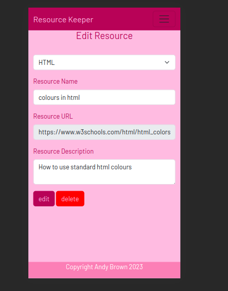

# Testing

Return back to the [README.md](README.md) file.

### HTML

I have used the recommended [HTML W3C Validator](https://validator.w3.org) to validate all of my HTML files.

| Page | W3C URL | Screenshot | |
| --- | --- | --- | --- |
| Home | [W3C](https://validator.w3.org/nu/?doc=https%3A%2F%2Fresource-keeper-9faa6ecfb87f.herokuapp.com%2F) |  | 

### CSS

I have used the recommended [CSS Jigsaw Validator](https://jigsaw.w3.org/css-validator) to validate all of my CSS files.

| File | Jigsaw URL | Screenshot | Notes|
| --- | --- | --- | --- |
| style.css | [Jigsaw](https://jigsaw.w3.org/css-validator/validator?uri=https%3A%2F%2Fresource-keeper-9faa6ecfb87f.herokuapp.com%2F&profile=css3svg&usermedium=all&warning=1&vextwarning=&lang=en) || Some warnings about Bootstrap classes when testing live site. Screenshot shows css code tested by direct input to validator

### Python PEP8 Compatibility

I have used the [CI Python Linter](https://pep8ci.herokuapp.com/)  to check Python code for compatibility with the [PEP8 standard](https://peps.python.org/pep-0008/).

| Python File | Screenshot | Notes |
| --- | --- | --- |
| routes.py |  | No errors or warnings |
| run.py |  | No errors or warnings |
| __init___.py |  | No errors or warnings |
| models.py |  | No errors or warnings |

## Browser Compatibility

I've tested my deployed project on multiple browsers to check for compatibility issues.

| Browser | Screenshot | Notes |
| --- | --- | --- |
| Chrome |  | Works as expected |
| Firefox |  | Works as expected |
| Opera |  | Works as expected |

## Responsiveness

I've tested my deployed project on multiple devices to check for responsiveness issues.

| Device | Page |Screenshot | Notes |
| --- | --- | --- | --- |
| Mobile (DevTools) | Home | | Works as expected |
| Tablet (DevTools) | Home | | Works as expected |
| Laptop | Home | | Works as expected. |
| Mobile (DevTools) | View Resources | | Works as expected |
| Tablet (Dev Tools) | View Resources | | Works as expected. |
| Laptop | View Resources | | Works as expected. |
| Mobile (DevTools) | Add Resource | | Works as expected |
| Tablet (DevTools) | Add Resource | | Works as expected |
| Laptop | Add Resource | | Works as expected. |
| Tablet (DevTools) | Edit Category | | Works as expected |
| Mobile (DevTools) | Edit Category | | Works as expected |
| Laptop | Edit Category | | Works as expected. |
| Mobile (DevTools) | New Category | | Works as expected |
| Tablet (DevTools) | New Category | | Works as expected |
| Laptop | New Category | | Works as expected. |
| Mobile (DevTools) | Edit Resource | | Works as expected |
| Tablet (DevTools) | Edit Resource | | Works as expected |
| Laptop | Edit Resource | | Works as expected. |

## Lighthouse Audit

I've tested my deployed project using the Lighthouse Audit tool to check for any major issues.

| Page | Size | Screenshot | Notes 
| --- | --- | --- | --- |
| Home | Mobile |  | Some minor warnings |
| Home | Desktop |  | Some minor warnings |

## Defensive Programming

Defensive programming was manually tested with the below user acceptance testing. 
Note that tests of custom error pages also satisfy aspects of "User story testing".

| User Action | Expected Result | Pass/Fail | Screenshot |Comments|
| --- | --- | --- | --- |---| 
| Click form buttons without filling required form fields | Inform user field is required | Pass | |The screenshot shows the "tip" informing user field is required. This protection applies to all required form fields in the app|
| Delete a resource or category from database | A modal appears prompting for delete confirmation | Pass | |Modal requiring confirmation is triggered on deleting a category or resource from database|
| Visit non-existent route | 404 not found page is shown | Pass | |404 error page is shown and link back to home page provided|
| User experiences a server error | 500 server error page is shown| Pass | |500 error page is shown and link back to home page provided|

## User Story Testing
[User story testing ](https://github.com/doctorandrewbrown/flask-resource-keeper/blob/main/README.md/#user-stories) was conducted for all user stories detailed above. This ensured that all features were tested as well as CRUD functionality in that users can create, read, update and delete records as demonstrated below.

| User Story | Demo Video | Comments |
| --- | --- |----| 
| As a site user, I would like to create a new resource category | [video](https://github.com/doctorandrewbrown/flask-resource-keeper/assets/29900160/17757314-3340-48a9-899a-a10764a2383e) |the video shows creation of a new category|
| As a site user, I would like to create a new resource within a category | [video](https://github.com/doctorandrewbrown/flask-resource-keeper/assets/29900160/6231e9cd-6a9a-437f-9e5b-48802a5fdbc2) |the video shows creation of a new resource|
| As a site user, I would like to view stored resources by category with a short note describing the resource. | [video](https://github.com/doctorandrewbrown/flask-resource-keeper/assets/29900160/0da052ed-b949-4751-bbf7-3eb3f409bc34) |the video shows a list of resources in the category and on-hover dropdown with resource description|
| As a site user, I would like to be able to access a resource (ie go to that url). | [video](https://github.com/doctorandrewbrown/flask-resource-keeper/assets/29900160/de9e84ae-a0f7-48a5-8ff1-282db8b4f7bb) |the video demonstrates accessing a resource on stackoverflow|
| As a site user, I would like to be able to edit a resource. | [video](https://github.com/doctorandrewbrown/flask-resource-keeper/assets/29900160/e15bc34a-37d0-4225-b114-90274c33f697) |the video demonstrates editing resource name|
| As a site user, I would like to be able to edit a category name | [video](https://github.com/doctorandrewbrown/flask-resource-keeper/assets/29900160/d4ded041-5818-4ced-b0cc-d1f201799633) |the video demonstrates editing (changing) a category name|
| As a site user, I would like to be able to move a resource to a different category | [video](https://github.com/doctorandrewbrown/flask-resource-keeper/assets/29900160/b8233b09-bd47-41d2-a830-f3fbac734c9d) |the video demonstrates moving a resource (test resource) from the flask category to wordpress category|
| As a site user, I would like to be able to delete a resource | [video](https://github.com/doctorandrewbrown/flask-resource-keeper/assets/29900160/15e60c9b-085f-40e9-ae6a-499989866082) |the video demonstrates deleting a resource|
| As a site user, I would like to be able to delete a category | [video](https://github.com/doctorandrewbrown/flask-resource-keeper/assets/29900160/35dc7818-fbe7-4e1c-9d07-b47a365774d8) |the video demonstrates deleting a category|
| As a site user, I would like to have custom error pages (http error codes 500 and 404) |  |custom 404 error page displayed to user|
| As a site user, I would like to have custom error pages (http error codes 500 and 404) |  |custom 500 error page displayed to user|
| As a site user, I would like to be able to delete a category | [video](https://github.com/doctorandrewbrown/flask-resource-keeper/assets/29900160/35dc7818-fbe7-4e1c-9d07-b47a365774d8) |the video demonstrates deleting a category|
| As a site user, I would like to be able to easily return to home page via main navigation ie Brand and Home links | [video](https://github.com/doctorandrewbrown/flask-resource-keeper/assets/29900160/8b4e403e-de64-41fa-991b-62d9a5301aee) |the video demonstrates return to home page from an inner pages (in the example video, CSS category resources view) back to homepage via main navigation links. Similar tests were satisfactory for all pages in the app|
| As a site user, I would like immediate visual feedback when creating a new category |[video]() |when a new category is created the user is redirected to a view showing new category|
| As a site user, I would like immediate visual feedback when creating a new resource |[video]() |when a new category is created the user is redirected to a view showing new resource|
| As a site user, I would like immediate visual feedback when deleting category |[video]() |when a new category is created the user is redirected to a view showing catrgories with deletion omitted|
| As a site user, I would like immediate visual feedback when deleting resource |[video]() |when a new category is created the user is redirected to a view showing resources with deletion omitted|

| As a site user, I would like immediate visual feedback when updating a resource |[video]() |when a resource details are updated the user is redirected to a view showing updated details|

